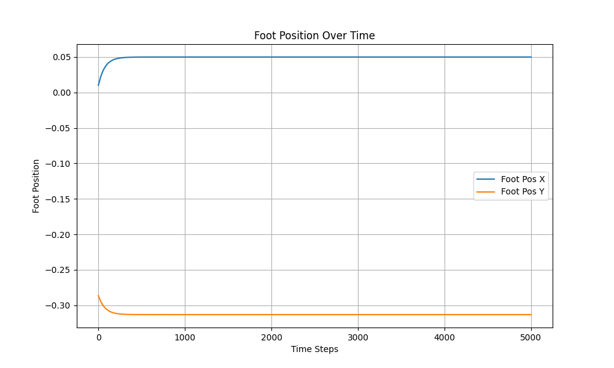
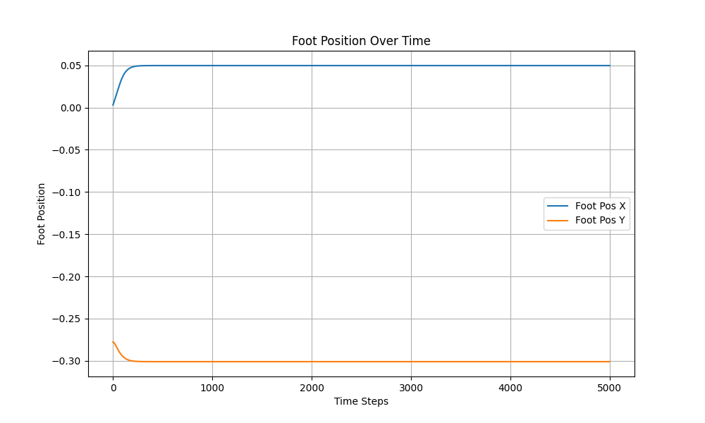

# Assignment 1 Report

## 3.2 Part2-Jacobian

- **1 Try changing the gain matrices Kp,Cartesian and Kd,Cartesian. How important are these? What happens if you set `on_rack` to `false` - can you use the same gains? How does this affect the foot position? How about when dragging the leg up and letting it fall?** 
  1. Kp and Kd are very important. Small Kp will result in slow reponse and large Kp leads to overshoot. large Kd will result in oscillation at equilibrium point.
  
  2. Yes.
     - This is the result when `on_rack` is set to `true` 
      
     - This is the result when `on_rack` is set to `False` 
     
 
  3. The z value of foot become a little larger if `on_track` is set to `Fasle`(z is negetive value) 

  4. The z value of foot will first increase and then decrease and eventually approach to target value.  
  

- **2 With `on_rack` set to `False`, now try to apply force control by compensating for gravity and the mass of the system (use env.robot.total_mass, and be careful with the sign). What are the minimum gains you can use?**
  - I use 2000 for Kp and 150 for kd. 
- **3 Plan a trajectory in task space and track it with the Cartesian PD controller. For example, decrease the hip height from 0.3 m to 0.2 m and vice versa over different time windows. Would you be able to plan such a trajectory in joint space?**
  - Theoretically we can do this in joint space. But first we need inverse kinemetic to convert the cartesian coordinate to joint angles.
- **4 What benefits do you see from using impedance control (i.e. Cartesian PD + force control)? What could be improved? (i.e. what if a particular joint configuration is required, for example if the leg should look like < or >. Try starting with different initial angle configurations.)**
  - PD control is very simple.
  - The PD controller we are using only focus on the end effector. Under large desired force, the leg shape could turn from < to >.
  - To prevent legs goes from < to >, we need to add some constraints to the joint angles.
  - We can add force = 0 when monitoring joint angles are out of the range.

## 3.3 Part 3 - Inverse Kinematics

- **1. Iterative IK: How can we find both sets of solutions with the algorithm (i.e. leg looking like < or > )?**
  - In the geometric solution, we can change the sign of $\theta_2 = \frac{r^2-l_1^2-l_2^2}{2 \cdot l_1 \cdot l_2}$ to decide if we want < or > shape.
- **2. What benefits do you see from tracking task space trajectories with inverse kinematics (and joint PD control) vs. impedance control (with Cartesian PD + force control)? When might you use one over the other? What if a particular joint configuration is required, for example if the leg should look like < or >? What about motor related considerations (torque sensing, bandwidth)?**
  - For joint PD control, we actually control the ouput based on joint angle differences. Therefore, we can control the shape of legs directly. 
  - If we need to strictly keep a leg configuration, I will choose joint PD control, since Cartesian PD + force control may not be able to keep the leg shape.
  - But the drawback of joint space control is abvious, we need either math models or larger iterations to get the desired joint angles.
  - So if my MCU has enough computation power, I will choose joint PD control. Otherwise, I will choose Cartesian PD + force control.

## 3.4 Part 4 - Single-Leg Hopping

- **1. Describe your methodology for implementing your jumping controller. What type of control do you use (joint space, task space, force profile)? Do the motions look realistic (torque limits)? Can you do both a single jump and continuous jumping (forwards/backwards/in place)?**
  - I used the task space control because it's very easy. I simply generate a sinwave force in both x and z direction and set all positive force value to zero. 
  - I can do jump forward and backward. But to jump in place is hard. Even if you just set x-direction force to zero, the robot still moves a little after jumping.